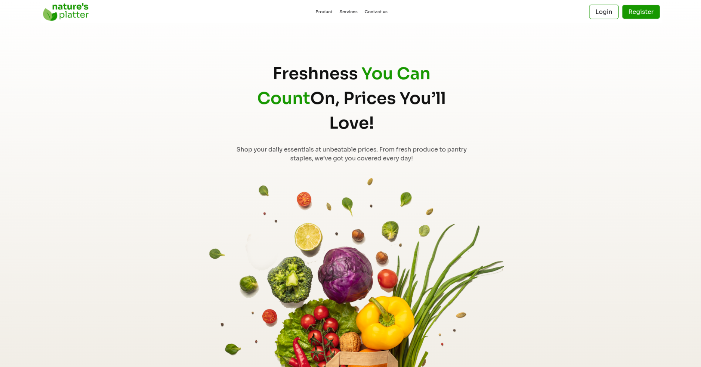
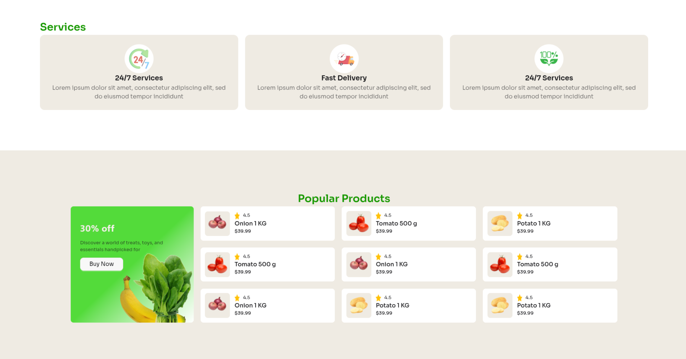
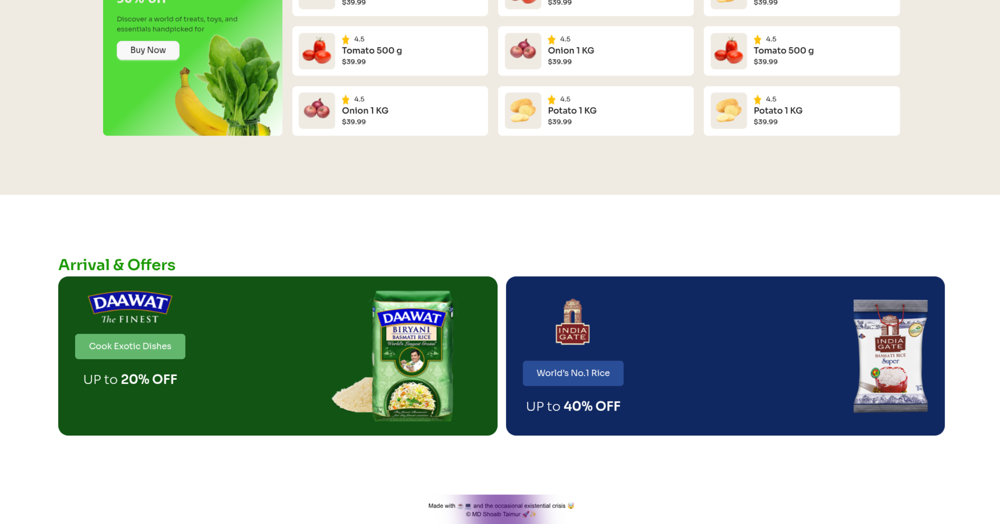

# 🌿 Nature’s Platter

**Freshness You Can Count On, Prices You’ll Love!**

A modern and minimal web layout that showcases fresh produce and daily essentials with smooth gradients, balanced colors, and clean typography.  
Built entirely using **HTML**, **Tailwind CSS**, and **DaisyUI** — no JavaScript or backend required!

---

## 🌱 Live Demo

👉 [View Project on GitHub Pages](https://shoaibtaimur.github.io/Project-Nature-s-Platter/)

---

## 🧩 Tech Stack

- **HTML5** – For semantic structure
- **Tailwind CSS** – For utility-first responsive styling
- **DaisyUI** – For prebuilt components and modern UI design

---

## 🎨 Features

✅ **Responsive Design**  
Looks great on all screen sizes — from mobile to 4K monitors.

✅ **Clean, Organic Theme**  
Soft green accents and natural tones inspired by nature.

✅ **Popular Products Section**  
A dynamic grid layout displaying product cards with images, ratings, and prices.

✅ **Gradient Offer Card**  
Beautiful green-to-white gradient offer section with a smooth text overlay.

✅ **DaisyUI Buttons & Cards**  
Stylish and consistent UI elements powered by DaisyUI for easy customization.

✅ **Simple & Lightweight**  
Only HTML and Tailwind — fast loading and easy to maintain.

---
---

### 💻 Preview





---

## 🖥️ How to Run Locally

1. Clone the repository:

   git clone https://github.com/shoaibtaimur/Project-Nature-s-Platter.git

2. Open the folder:

   cd Project-Nature-s-Platter

3. Run the project by simply opening `index.html` in your browser.

That’s it! 🎉 No dependencies or build tools required.

---

## 🧠 Folder Structure

```
Project-Nature-s-Platter/
├── Assets/               # Images and icons used in the project
├── index.html            # Main HTML file
├── README.md             # This file
└── style.css (optional)  # Tailwind CSS output (if generated manually)
```

---

## 💡 Customization Tips

You can easily customize:

- 🎨 **Colors & Gradients** → Update `from-[#53DB3A]`, `to-white`, or background shades.
- 🧱 **Grid Layouts** → Change `grid-cols-3`, `sm:grid-cols-2`, etc.
- 🔠 **Typography** → Modify text sizes like `text-[36px]` or font weights.
- 🧭 **Breakpoints** → Adjust responsive classes such as `sm:`, `lg:`, or `xl:`.

---

## 🌟 Future Improvements

- Add hover animations to product cards
- Add a shopping cart or wishlist UI
- Include testimonials or featured product sliders
- Introduce dark mode toggle using DaisyUI themes

---

## 👨‍💻 Author

**Developed by [Shoaib Taimur](https://github.com/shoaibtaimur)**
And design is inspired and copied from open source.
A passionate learner building beautiful and functional web projects using modern tools like Tailwind CSS and DaisyUI.

---

## 📜 License

This project is open source and available under the **MIT License**. You can use it , modify it and redistribute it.

---

> 💚 _Nature’s Platter — bringing fresh design and fresh produce together!_

